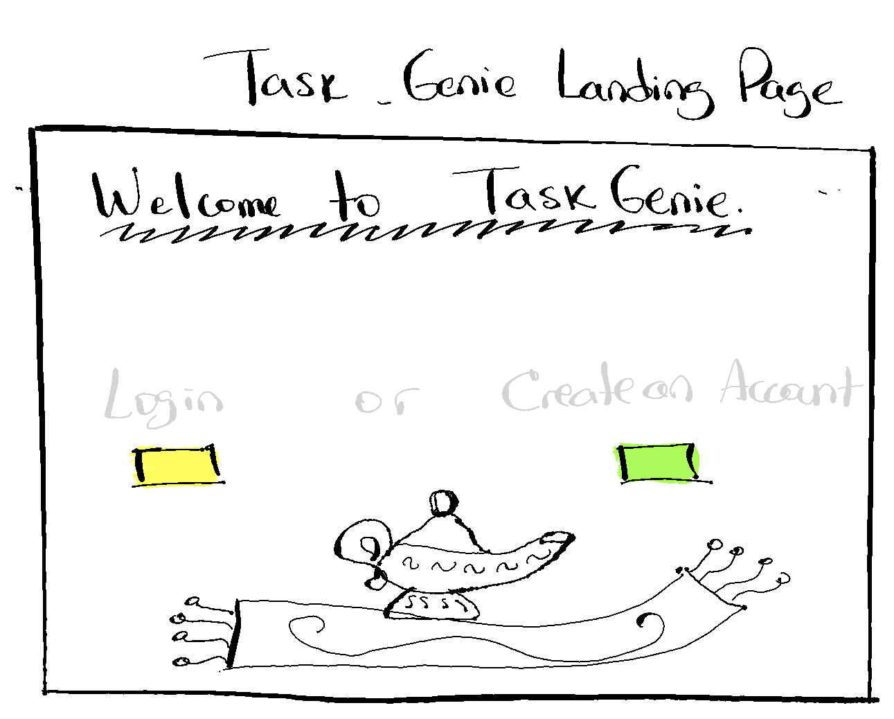
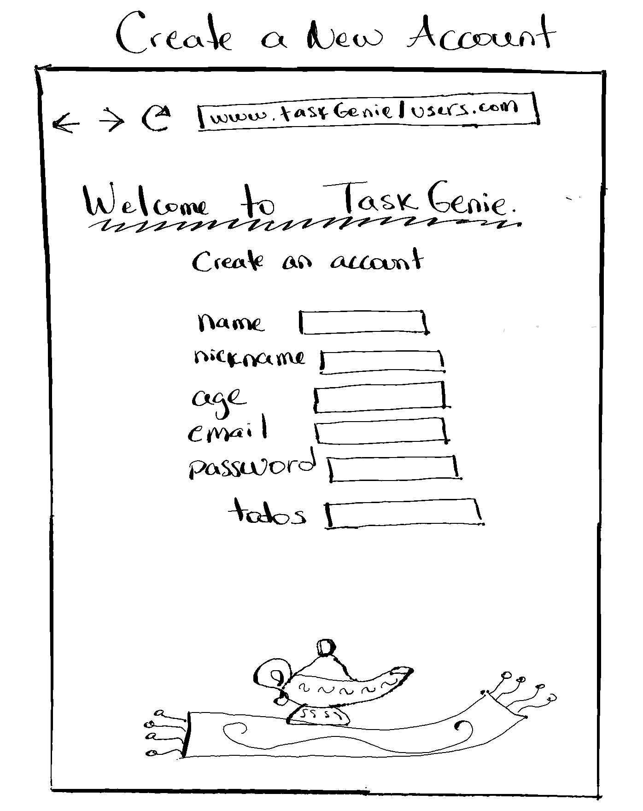
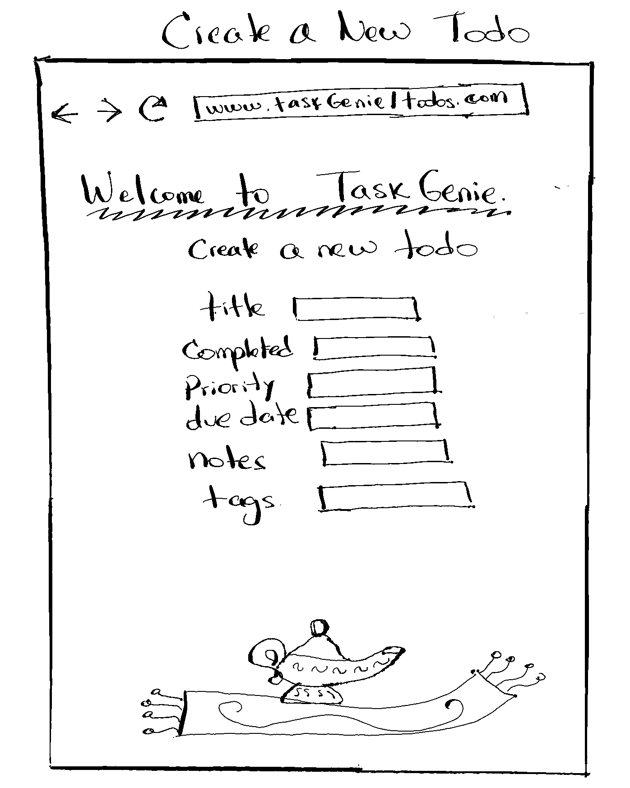
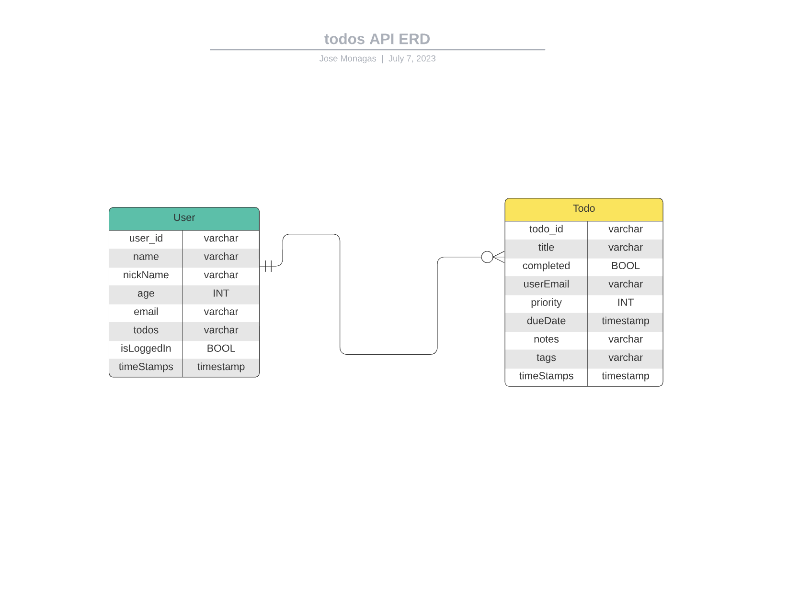

## Task Genie: Todo API

This Todo API is called Task Genie. Task Genie will allow you to create an account, login to your account, create todos, get all of your unfinished todos, get todos by their ids, update any field in your todos and delete them once you're done -if you choose to do so.

### Pseudocode and Trello

[link](https://trello.com/invite/b/OpkbweN5/ATTI93ad402475f1841b2f2566c5a384581dF2B57952/project-two-my-first-api)

### Prerequisites

You must ensure that you have the following packages installed in your machine:

- Node.js
- Nodemon - globally
- Postman downloaded in your machine

### Regular dependencies used

- Express
- Mongoose
- dotenv
- JSON-webtoken
- Morgan
- Bcrypt

### Developer dependencies used

- --save-dev
- Jest
- Supertest
- mongodb-memory-server
- Artillery@1.7.9

### Getting Started

1. Clone this repository
2. Install the required project dependencies by running **_npm i_**
3. Touch an _.env_ file in the root directory of the cloned project
4. Inside the _.env_ file add the following variables:

```

    MONGO_URI=mongodb://[username:password@]host1[:port1][,...hostN[:portN]][/[defaultauthdb][?options]]
    SECRET=your-secret-key

```

Replace username and password inside your MONGO_URI sting, it can be found in [mongodb](https://account.mongodb.com/account/login?n=%2Fv2%2F646d4760a3162445ce438d76&nextHash=%23clusters). I highly encourage you to encrypt your secret phrase, a good option is using [SHA256](https://emn178.github.io/online-tools/sha256.html)

5. To run the application in dev mode, run the command

```
npm run dev

```

The application will launch on port 3000.

### Run test cases

The application has 12 test cases, 6 for user endpoints and 6 for todos endpoints. To run the tests copy and paste in your terminal:

```
npm run test
```

### Load test and throughput

You must ensure that your server is running, then execute this command in your terminal:

```
npm run load
```

This will send 1200 requests to our server in 1 minute.

### Testing with Postman

1. Ensure your server is running and mongodb is listening
2. Open the Desktop Postman app
3. Send CRUD requests to the _http://localhost:3000/_ URL by following the structure in the routes.

For example, to create an account follow these steps:

- Select the request type to _POST_ request,
- The URL should be _http://localhost:3000/users_
- Select _body_ and then _raw_ and _JSON_.
- Copy and paste the following code in the body

```
{
    "name": "your name",
    "email": "example@gmail.com"
    "password": "passw3rk"
}
```

- Hit Send.

This should create a new user account. One caveat is that in the example I only used the required fields in the user schema for creating a new user account, but there are other fields available to you.

### Wireframes

At this stage, the API does not have a view, the following wireframes will give you a sneakpeek of what the front end might look like



---



---



### ERD

This API has two entities, Users and Todos. Users has zero to many relations with todos and todos has one to one relations with the users entity.


